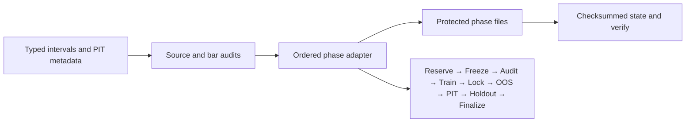

# Top-100 Research Workflow Framework

This portfolio contains **offline research/operations demonstrations** and a **redacted original source file for code review**. Start with the runnable examples below, or inspect [scripts/auto_trade_smc_mtf.py](scripts/auto_trade_smc_mtf.py) and its [review notes](scripts/README.md).

The workflow demonstrations are strategy-free and use synthetic metadata and record counts. They do not download market data, produce signals, trade, report investment performance, or establish a historical research result. The separate source-review file retains non-Fibonacci strategy and operational code at the owner's request, with private Fibonacci material removed and execution disabled. “Binance” describes the study origin; this project is not affiliated with or endorsed by Binance.

Python 3.12 and its standard library are sufficient. From this directory:

```sh
python -B -m unittest discover -s tests -v
python -B -m research_framework demo --output run-example
python -B -m research_framework verify --output run-example
python -B -m research_framework demo --output run-example
```

The final command resumes without repeating completed phases. Change one byte in a phase artifact and `verify` exits 2. Use a new empty output directory for a separate synthetic run. The output is labeled `SYNTHETIC_WORKFLOW_DEMO`, with `research_authority=NONE`.



The generic `PhaseAdapter` owns study-specific evidence and must explicitly accept each phase. The included adapter validates the toy spec, availability and bar sequence, then records counts. For a real study, the operator must independently establish source provenance, methodology, authorization and holdout custody; this demo cannot certify them. An interrupted invocation remains blocked for manual evidence recovery to avoid silently repeating a holdout call. No automatic recovery or rerun proves untouched history.

The workflow adaptation captures ideas from an internal study without its strategy, data, settings or results. Development and documentation are AI-assisted under human direction and review. The separate redacted source preserves original code for inspection; it is not a runnable release. The human owner defines the publication boundary and research governance; the demonstration is not presented as a hand-coded production engine. Source is available for evaluation; no license grant is supplied.

Read [methodology](docs/METHODOLOGY.md), [artifact contracts](docs/ARTIFACTS.md), and [publication boundary](docs/PROVENANCE.md) before extending the adapter. The example [configuration](examples/spec.json) is illustrative and contains no data source or trading settings.

## Goal and operations example

The separate standard-library `operations_demo` package demonstrates a single active goal, evidence-bound completion and a bounded synthetic worker with restartable local checkpoints. It contains no service connection, external data or deployment action. Run it from this directory:

```sh
python -B -m operations_demo demo --output operations-output
python -B -m operations_demo verify --output operations-output
python -B -m operations_demo demo --output operations-output
```

The last command checks the completed output without rewriting files. See [goal states and handover](docs/GOALS.md), [operations checklist and incident example](docs/OPERATIONS.md), the [goal template](examples/goal-template.json), and [illustrative service unit](deploy/workflow-demo.service). These are offline portfolio examples only; the local checks do not prove deployment health or authorize any operational change.
